# Khayt · خيط

**Free, offline-first production management for 3D printing businesses.**
Quoting · Kanban · ZATCA e-invoicing · Inventory · Analytics · Customer portal

Built with Electron · Vanilla JS · No cloud · No subscription · Your data never leaves your machine.

[](https://github.com/Alballaa/Khayt/releases/latest)
[](./LICENSE)
[](#installation)
[](https://khaytapp.com)

---

## Screenshots

| Dashboard | Calculator & Quoting |
|:---------:|:--------------------:|
| 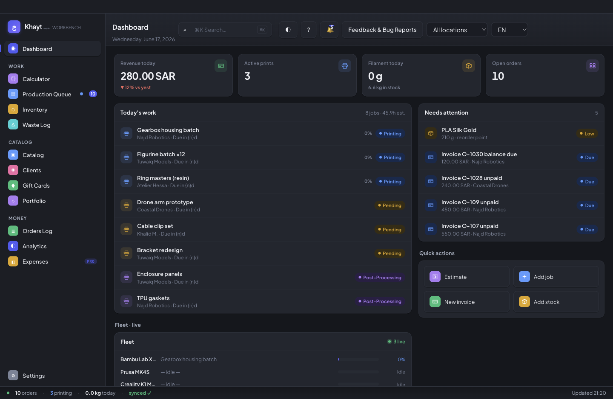 | 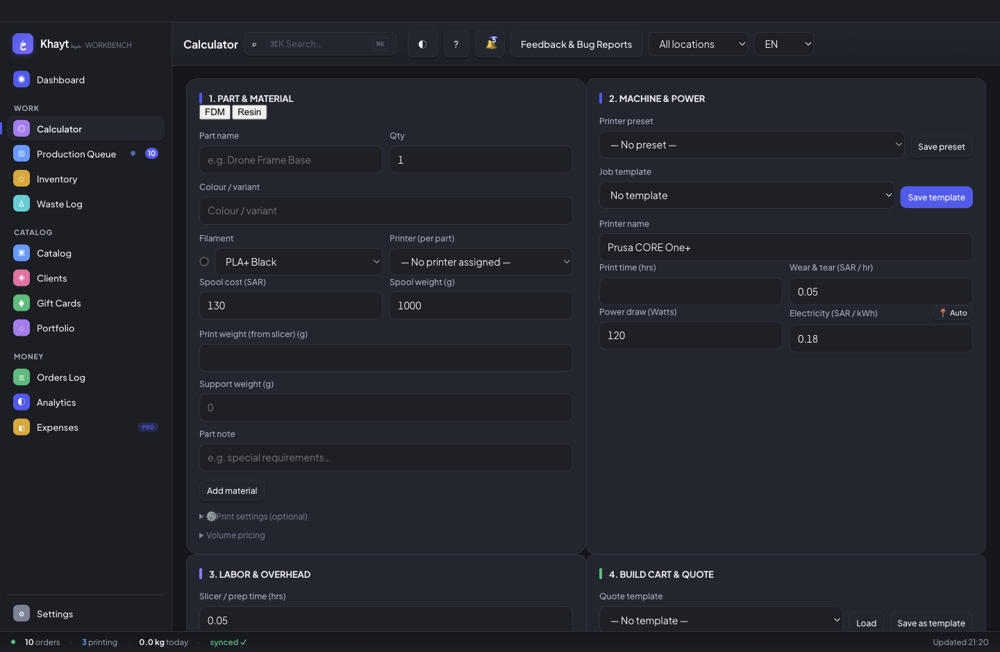 |

| Production Queue (Kanban) | Orders Log |
|:-------------------------:|:----------:|
| 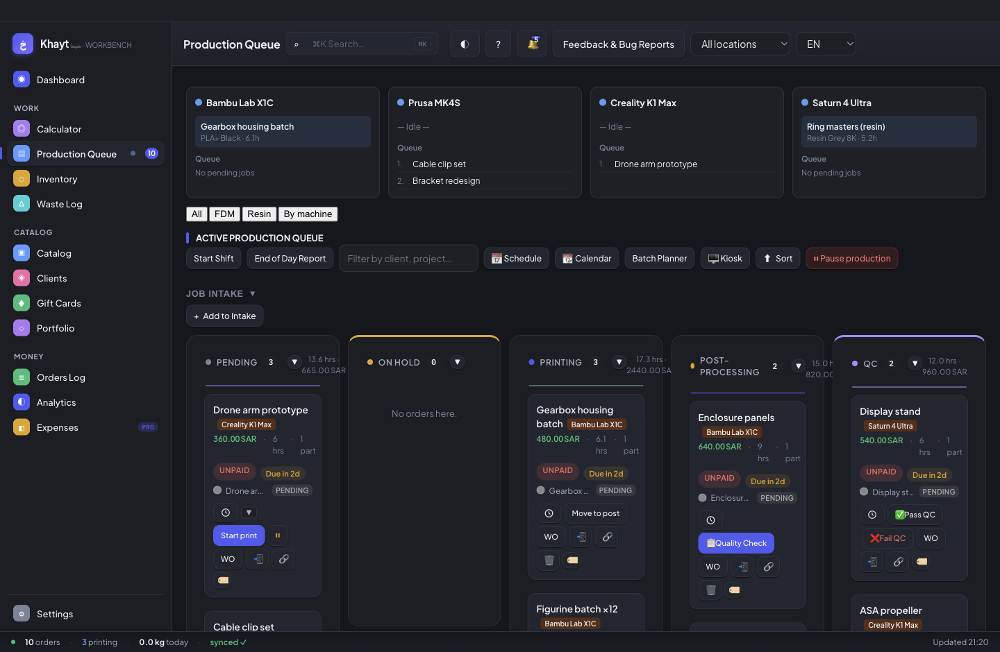 | 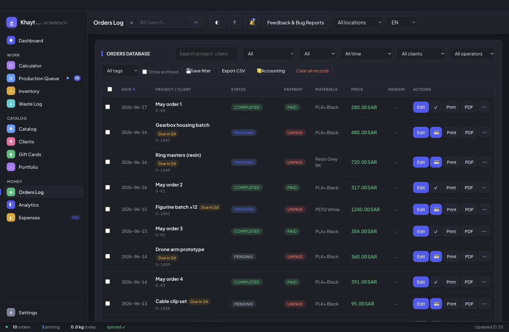 |

| Analytics | Inventory |
|:---------:|:---------:|
| 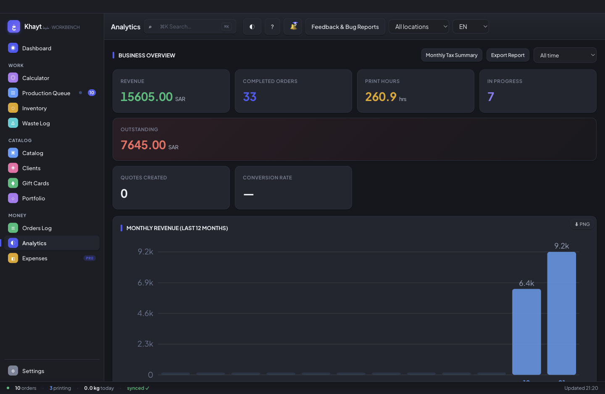 | 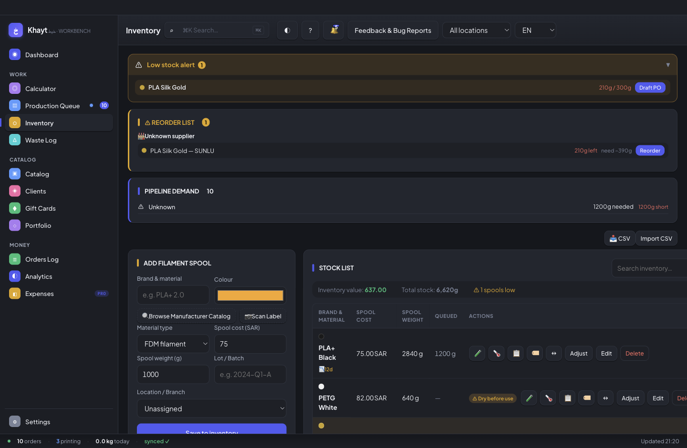 |

| Clients & CRM | Gift Cards |
|:-------------:|:----------:|
| 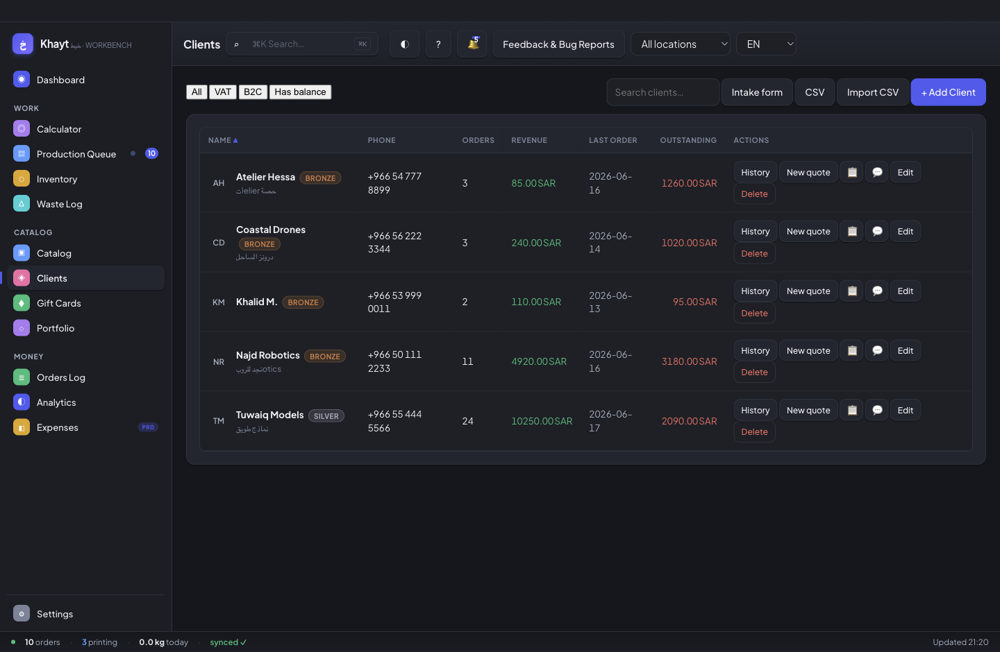 | 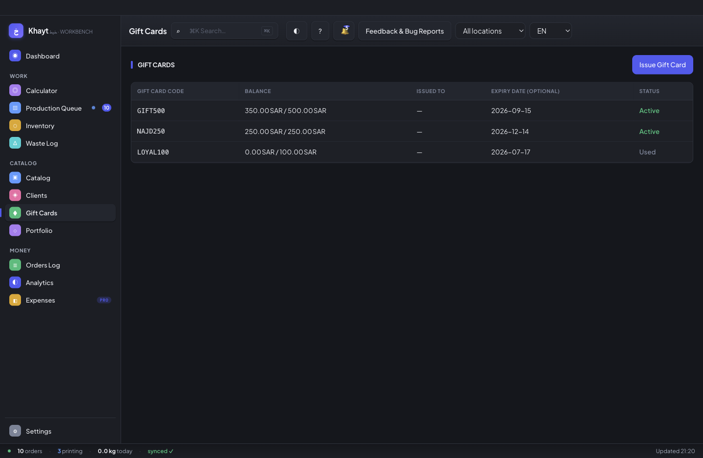 |

| Product Catalog | Waste Log |
|:---------------:|:---------:|
| 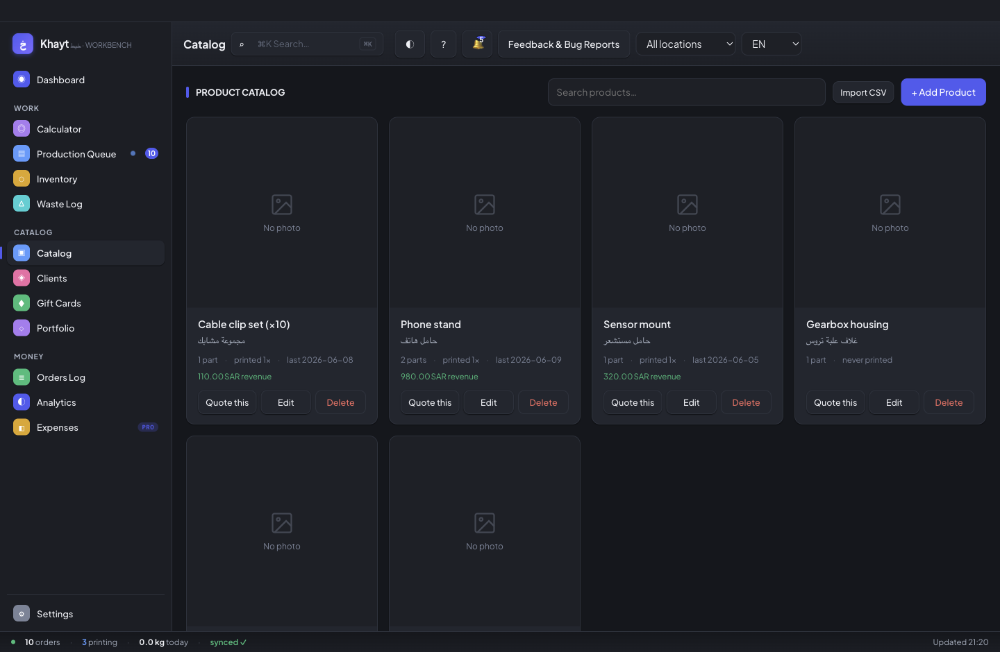 | 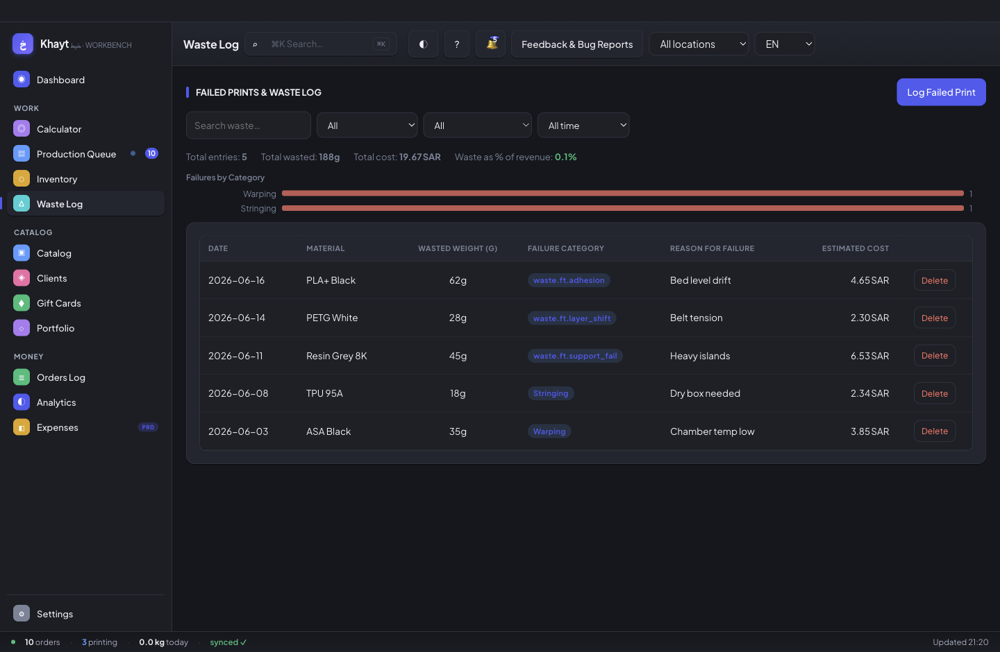 |

| Invoice & ZATCA Settings | Print Portfolio |
|:------------------------:|:---------------:|
| 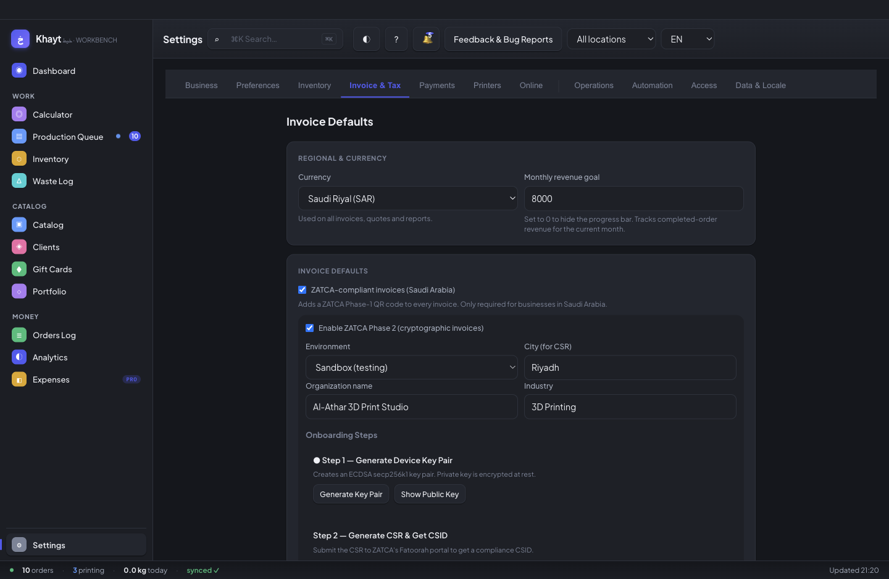 | 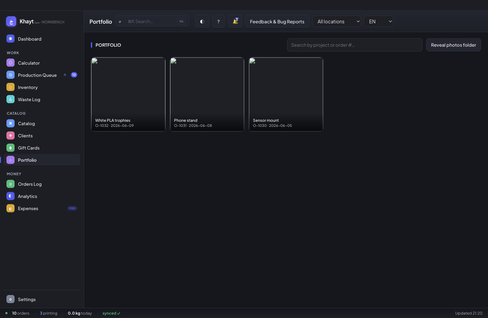 |

Full-resolution PNGs are also attached to each [GitHub Release](https://github.com/Alballaa/Khayt/releases/latest).

---

## What Khayt does

Khayt replaces spreadsheets, WhatsApp notes, and separate invoicing tools with one desktop app designed specifically for 3D printing shops. Everything runs locally — no internet required, no monthly fees, no data sent anywhere unless you explicitly configure an integration.

---

## Features

### 💰 Calculator & Quoting
- Multi-part cart with live cost breakdown: material, machine time, electricity, labour, overhead, failure rate, and margin
- FDM (gram-based) and Resin (mL-based) support
- Multi-material / AMS / MMU job costing
- Volume pricing tiers and automatic loyalty discounts
- G-code & 3MF metadata auto-extraction (print time, weight)
- Quote PDF export with revision history and approval link
- Slicer profile library per machine × material (layer height, infill, supports)

### 📋 Production Queue (Kanban)
- Drag-and-drop board: Pending → Printing → Post-Processing → QC → Completed
- Per-machine queue view with live progress rings
- On-hold with reason, change-order workflow with audit log
- Shift-start checklist and end-of-day summary report
- Print failure photo capture from kanban cards
- Live printer API: OctoPrint, Moonraker, Bambu Cloud polling

### 🔄 Recurring & Intake
- Recurring orders — auto-generated weekly, bi-weekly, or monthly
- Online intake form (public URL via LAN server — customers submit quote requests from their phone)
- Quote approval link — customers approve quotes from a shareable URL
- Waiting list funnel with reminder scheduling and conversion tracking
- Salla & Zid inbound order webhooks (HMAC-verified)

### 🧾 Invoicing (ZATCA Phase 1 & 2)
- Bilingual EN/AR invoices with TLV-encoded QR code (Phase 1)
- ZATCA Phase 2: cryptographic signing (ECDSA), CSR generation, compliance and production CSID, e-invoice submission to FATOORA
- Proforma invoices, milestone-based partial invoicing
- Credit notes and change orders
- GAZT VAT return export (Box 1/2/3/6/7)
- PDF export, WhatsApp sharing, email delivery (SendGrid / Mailgun / custom SMTP)

### 💳 Payments & BNPL
- BNPL payment links: Tabby, Tamara, Stripe
- Gift cards / store credit with balance tracking and expiry
- Payment reconciliation and aged receivables report

### 📦 Inventory
- Filament spools with auto-deduction on order completion
- FIFO / weighted-average cost tracking
- Reorder alerts with draft purchase orders
- Colour variants library, spool drying log, test print results
- Price history per supplier, multi-location support

### 👥 Clients & CRM
- Client profiles with bilingual fields, VAT number, CR number
- Credit limits, loyalty tiers with automatic discounts
- Referral attribution and acquisition-source analytics
- Live customer portal (order tracking page, auto-refreshing)
- NPS satisfaction surveys with one-time token links

### 📊 Analytics
- Revenue, orders, filament usage, waste, and operator hours
- Machine P&L, break-even dashboard, cost-per-gram trends
- Multi-currency support with live exchange rates
- Environmental condition logging (temperature & humidity) with sparkline charts
- Acquisition sources chart and top-referrer leaderboard
- Production heatmap, retention rates, NPS trends

### 🏭 Machines & Operations
- Maintenance log with service intervals and alerts
- Nozzle tracking (material, diameter, replacement threshold)
- Environmental condition log per session
- Operator time tracking with hourly rates and shift analytics
- Downtime and waste logging with failure categories

### 🔔 Notifications
- Telegram notifications (per-event: completed, on-hold, low stock)
- Email digest (daily/weekly summary — scheduled delivery)
- Outbound webhooks (HMAC-signed) for order and inventory events

### 📱 LAN Server & Mobile Access
- Embedded HTTP server — accessible from any device on your Wi-Fi
- **iOS Companion app** ([`ios/`](./ios/)) — native SwiftUI client for queue, inventory, and NFC spool scanning ([docs]([docs/LAN_API.md](./docs/LAN_API.md) · [IOS_COMPANION.md](./docs/IOS_COMPANION.md)))
- Live queue dashboard (PWA, works as a home-screen app)
- Customer order tracking pages (`/order/:id`)
- Public intake form (`/intake`) for quote requests
- iCal feed (`/calendar.ics`) — subscribe in Apple Calendar, Google Calendar, Outlook
- PIN-protected REST API with brute-force lockout
- LAN tunnel (via localtunnel) for remote access over the internet

### 🔄 Auto-Updates
- Automatic update checks via GitHub Releases
- In-app download progress and one-click install

### ⚙️ Settings & Integrations
- 7 UI languages: English, Arabic, German, Spanish, French, Chinese, Japanese
- Full RTL support for Arabic
- Dark / Light / System theme
- Operator PIN lock with role-based access (Admin / Technician / Sales)
- Auto-backup (local JSON snapshots + iCloud on macOS)
- Import / Export all data
- Custom invoice number prefix with gap detection
- Working hours schedule and public holidays
- Workbench UI — light, native-feel default design with sidebar navigation, Kanban production queue, and focused dashboards (plus Command, Vivid, and legacy theme options)

---

## Installation

### Download (recommended)

**Stable (recommended):** **[Releases → Latest](https://github.com/Alballaa/Khayt/releases/latest)** — currently **v2.5.0**.

**Beta:** **[Pre-releases](https://github.com/Alballaa/Khayt/releases)** — **v2.6.0-beta** ships the redesigned **Workbench** (default), **Command**, and **Vivid** themes. Pre-release builds; stable installs do not auto-update to beta. See [docs/BETA-RELEASE.md](docs/BETA-RELEASE.md).

Grab the file for your platform:

| Platform | File | Notes |
|---|---|---|
| macOS (Apple Silicon) | `Khayt-*-arm64.dmg` | Requires Apple Silicon (M1 or later) |
| Windows (installer) | `Khayt-*-Setup.exe` | NSIS installer, adds Start Menu shortcut |
| Windows (portable) | `Khayt-*-portable.exe` | No installation needed |
| Microsoft Store | [coming soon] | Will appear in the Store once approved |
| Linux (AppImage) | `Khayt-*.AppImage` | `chmod +x` then run |
| Linux (deb) | `Khayt-*.deb` | `sudo dpkg -i Khayt-*.deb` |

---

### Build from source

Requires **Node.js 22.12+** (22 LTS or 24.x). On **Node 24.16+**, Electron’s zip step needs system `unzip` on macOS (`xcode-select --install` if missing).

```bash
git clone https://github.com/Alballaa/Khayt.git
cd Khayt
npm install            # downloads Electron (~150MB); wait until it finishes
npm start              # development (live-reload with ⌘R / Ctrl+R)
```

#### macOS: `path.txt` missing / Electron won't start

If `npm start` fails with `ENOENT ... node_modules/electron/path.txt`, your tree is missing the awaited Electron installer (or `npm install` exited before the ~150MB download finished).

Quick fix:

```bash
npm run install:electron
npm start
```

If that does not help, see **[docs/LOCAL_SETUP.md](./docs/LOCAL_SETUP.md)** or follow these steps:

1. **Update the repo** (you need `scripts/install-electron-await.js` on `main`):

   ```bash
   cd ~/Documents/Khayt
   git fetch origin
   git pull origin main
   ```

   If `git pull` complains about divergent branches and you have no local commits to keep:

   ```bash
   git reset --hard origin/main
   ```

2. **Reinstall Electron** (wait until it prints `Success`):

   ```bash
   rm -rf node_modules/electron
   rm -rf ~/Library/Caches/electron
   npm install
   node scripts/install-electron-await.js
   cat node_modules/electron/path.txt    # should print: Electron.app/Contents/MacOS/Electron
   npm start
   ```

3. **Slow or blocked download** — use a mirror, then run step 2 again:

   ```bash
   export ELECTRON_MIRROR=https://npmmirror.com/mirrors/electron/
   node scripts/install-electron-await.js
   ```

Use **Node.js 22.12+** (LTS 22 or 24 is fine). Do not run `node node_modules/electron/install.js` alone; it can return before the download completes. The await script uses `unzip` on macOS (not the broken `extract-zip` path on Node 24.16+).

To build distributable packages:
```bash
npm run dist:mac:arm64   # macOS Apple Silicon DMG
npm run dist:mac:x64     # macOS Intel DMG
npm run dist:win         # Windows NSIS + portable + MSIX (run on Windows)
npm run dist:linux       # Linux AppImage + deb
```

---

## Data & Privacy

- All data is stored locally on your device — never transmitted to Khayt's servers
- Data file: `~/Library/Application Support/Khayt/khayt-store.json` (macOS) or equivalent
- API keys and secrets are encrypted at rest using your OS secure storage (macOS Keychain / Windows Credential Store)
- No telemetry, no crash reporting, no usage analytics
- **Backup:** Settings → Export all data → saves a portable JSON backup
- **Restore:** Settings → Restore backup → pick any backup file
- Auto-backup creates daily snapshots locally; iCloud backup available on macOS

Full privacy policy: [privacy.html](./privacy.html)

---

## ZATCA Compliance

### Phase 1
Every invoice includes a TLV-encoded base64 QR code with seller name, VAT number, timestamp, total, and VAT amount. Enable in **Settings → Business → VAT number**.

### Phase 2
Full cryptographic e-invoicing for the Saudi FATOORA platform:
1. Generate an ECDSA keypair in Settings → ZATCA Phase 2
2. Generate a CSR and submit to ZATCA for a compliance CSID
3. Run the compliance check, then obtain a production CSID
4. All subsequent invoices are signed and submitted automatically

---

## Project Structure

```
Khayt/
├── main.js              # Electron main process — IPC, file I/O, LAN server, updater
├── preload.js           # Context bridge — exposes hubAPI to renderer
├── lib/                 # Shared main-process modules (store I/O, LAN, ZATCA, updater)
├── renderer/
│   ├── index.html       # Single-page app shell with all tab panels
│   ├── app.js           # Thin entry shell (feature logic in renderer/*.js)
│   ├── studio/          # Studio UI styles and layout helpers
│   ├── locales/         # Per-language string bundles (en, ar, de, es, fr, zh, ja)
│   └── …                # Feature modules (dashboard, kanban, inventory, …)
├── assets/              # App icons, README screenshots, store tiles
├── docs/LOCAL_SETUP.md  # Extended setup notes (macOS Electron, mirrors)
├── docs/PLATFORM-MIGRATION.md  # Stay on Electron vs native rewrite (decision record)
├── docs/FARM-FEATURES.md  # Print farm / multi-location on one machine
├── privacy.html         # Privacy policy (required for Store submissions)
└── .github/workflows/
    └── release.yml      # CI: build DMG + EXE + AppImage on version tags
```

---

## Versioning

Khayt is on the **2.1.x** release line (latest: **2.1.0** in `package.json`):

| Release type | Example | Use for |
|--------------|---------|---------|
| Patch (minor day-to-day updates) | `2.1.0` → `2.1.1` | Fixes and small improvements |
| Minor (significant updates) | `2.1.x` → `2.2.0` | New features, compatible with existing data |
| Major | `2.x.x` → `3.0.0` | Breaking changes or required migration |

Full policy, tagging, and release steps: **[VERSIONING.md](./VERSIONING.md)**. Change history: **[CHANGELOG.md](./CHANGELOG.md)**.

## Contributing

Issues and pull requests are welcome. Maintainer workflow: **[CONTRIBUTING.md](./CONTRIBUTING.md)**. Planned engineering work: **[ROADMAP.md](./ROADMAP.md)**.

When reporting a bug, please include:
1. OS and app version (shown in **Settings → About**)
2. Steps to reproduce
3. What you expected vs what happened

---

## License

**MIT + Commons Clause** — free to use for running your 3D printing business, personal or commercial. You may not sell, resell, or offer Khayt as a hosted service. See [LICENSE](./LICENSE) for the full terms.

---

*Khayt (خيط) means "thread" in Arabic — the filament that ties everything together.*
