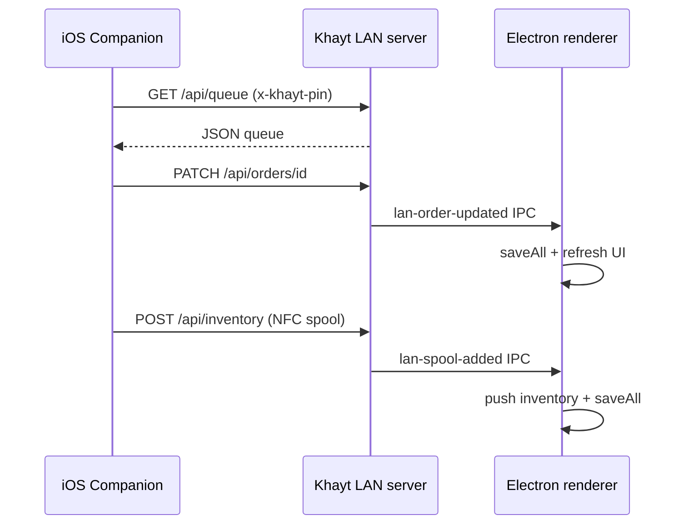

# iOS Companion architecture

The iOS app is a thin native client for the LAN server embedded in Khayt desktop. It does not implement business logic or store data locally beyond connection settings.

## Data flow

## NFC

Tag parsing mirrors `renderer/inventory.js`:

- **OpenTag3D** — `application/opentag3d` NDEF or raw binary
- **OpenPrintTag (Prusa)** — `application/vnd.openprinttag` CBOR

Swift implementation: `ios/KhaytCompanion/NFC/NFCParser.swift`.

## Security

- PIN is stored in the iOS Keychain (`ConnectionSettings` / `KeychainHelper`).
- Traffic is plain HTTP on the LAN; use only on trusted networks. The desktop app warns before enabling `localtunnel` for the same reason.
- `NSAllowsLocalNetworking` is set in `Info.plist` so App Transport Security permits RFC1918 hosts.

## Extending

New companion features should add LAN routes in `lib/lan-server.js` first, then call them from `KhaytAPIClient.swift`. Keep the desktop renderer in sync via IPC events when mutating the store.
