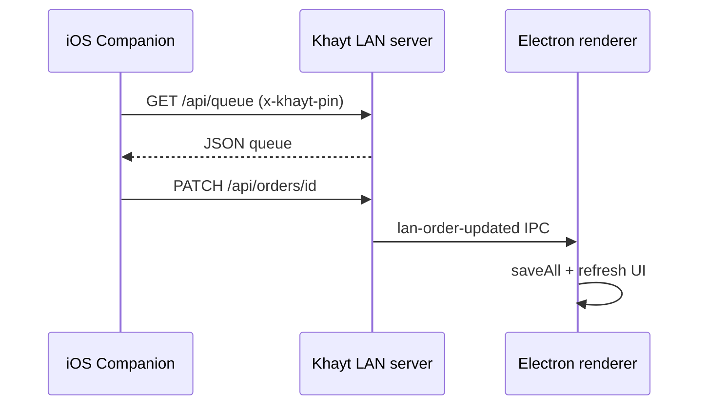

# iOS Companion (v1)

Native **LAN-only** client. The desktop app remains the source of truth (`khayt-store.json`).

## v1 scope

| Feature | LAN API |
|---------|---------|
| Pairing (IP + owner PIN) | `GET /api/status` + `GET /api/queue` |
| Connection health | Periodic `GET /api/status` |
| Production queue | `GET /api/queue`, `PATCH /api/orders/:id` |
| Light inventory | `GET /api/inventory`, `POST /api/inventory` |
| Machines glance | `GET /api/machines` |
| Add spool (Inventory +) | Scan label, NFC, or manual → `POST /api/inventory` |
| Label / NFC fields | Optional SKU, lot, print/bed temp when on label or tag |
| Order history | `GET /api/orders?limit=` (Recent tab under Orders) |
| Dashboard alerts | Low-stock count, active order preview, quick actions |
| Search & filters | Inventory search; low-stock filter; queue status chips |

**UI redesign:** copy the prompt in [IOS_UI_REDESIGN_PROMPT.md](./IOS_UI_REDESIGN_PROMPT.md) into your design AI.

## Out of scope (v1)

Calculator, ZATCA, invoicing, full settings, offline-first local database, cloud sync.

Alternative: LAN **PWA** (Add to Home Screen) — good for quick queue view; native app adds NFC, Keychain PIN, and App Store path later.

## Architecture



## Repo layout

```
ios/KhaytCompanion/          SwiftUI sources
ios/KhaytCompanion.xcodeproj
docs/LAN_API.md              Canonical API reference
```

Prior draft work lived on branch `claude/ios-app-mvwgj` (XcodeGen `ios/Khayt/`). Current target is `ios/KhaytCompanion/` on `cursor/ios-companion-app-2e93`.

## Security

- Owner PIN in iOS Keychain
- HTTP on trusted LAN only (`NSAllowsLocalNetworking`)
- Same brute-force limits as desktop LAN server

## Extending

1. Add route in `lib/lan-server.js`
2. Document in `docs/LAN_API.md`
3. Call from `KhaytAPIClient.swift`
4. If mutating store, emit IPC so desktop UI stays in sync
